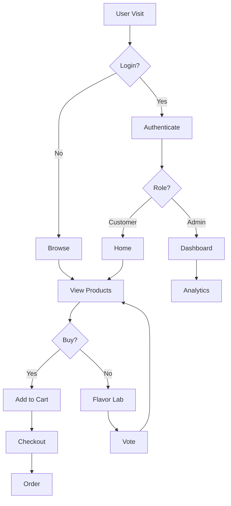
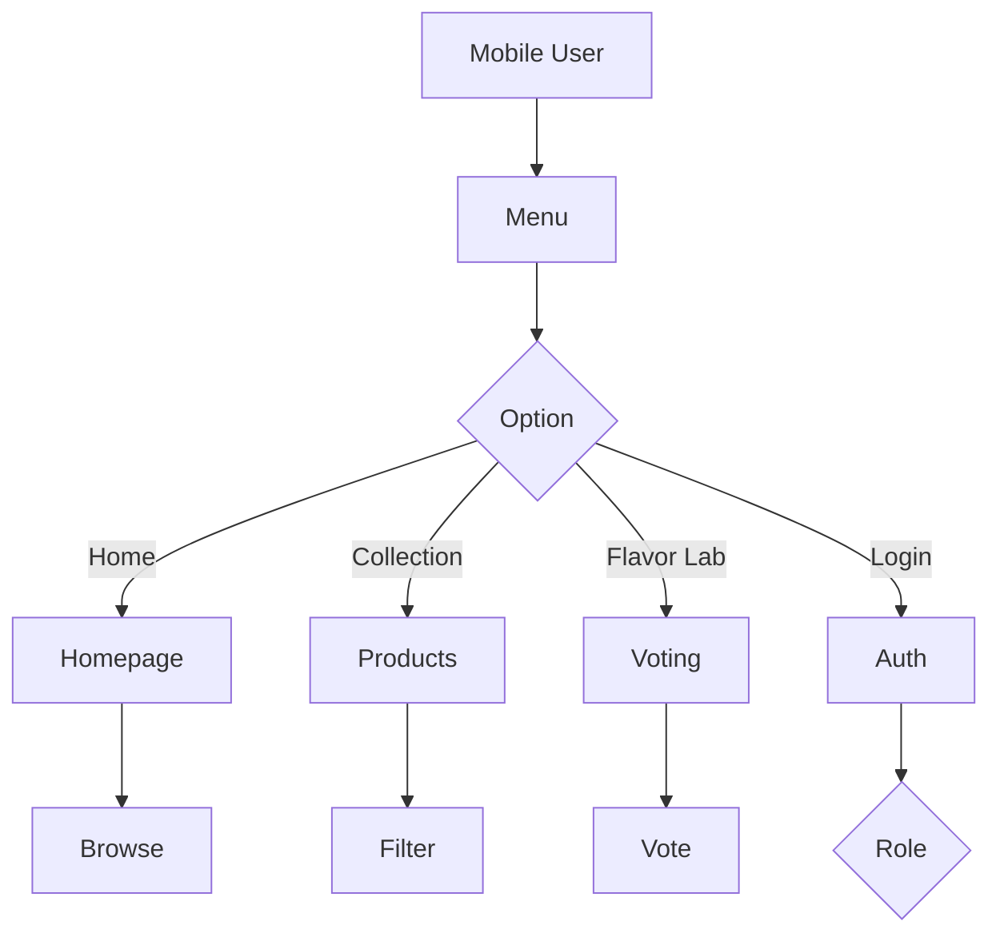
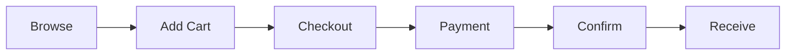

# Fiocchi Popcorn Website Flowchart

## Simple User Journey

## Mobile Flow

## Purchase Flow

## Key Features

- Clean, simplified flows
- Focus on main user paths
- Mobile-friendly navigation
- Clear decision points
- Minimal but complete coverage